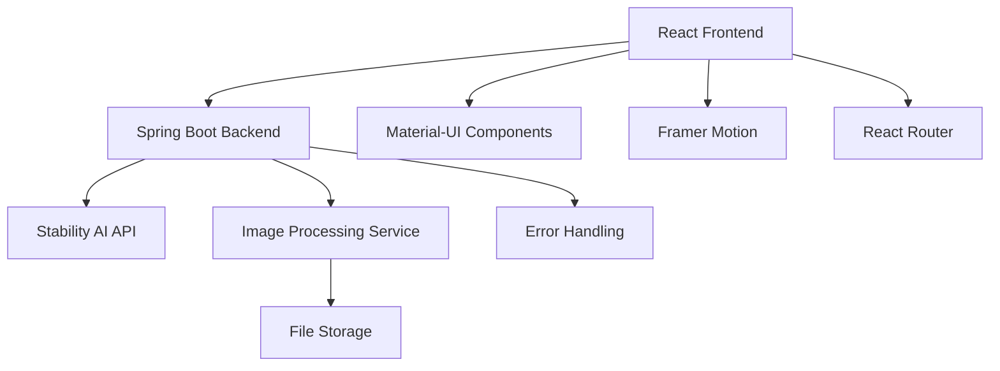

# 🎨 GIBILI AI - Studio Ghibli Style AI Art Generator

<div align="center">


**Transform your imagination into stunning Studio Ghibli-style artwork with the power of AI**

[](https://opensource.org/licenses/MIT)
[](https://www.oracle.com/java/)
[](https://spring.io/projects/spring-boot)
[](https://reactjs.org/)
[](https://nodejs.org/)
[]()
[](http://makeapullrequest.com)

[🚀 Live Demo](#) • [📖 Documentation](#documentation) • [🐛 Report Bug](https://github.com/LalalnaGurusinghe/GIBILI_AI/issues) • [✨ Request Feature](https://github.com/LalalnaGurusinghe/GIBILI_AI/issues)

</div>

---

## 📑 Table of Contents

- [🌟 Overview](#-overview)
- [✨ Features](#-features)
- [🏗️ Architecture](#️-architecture)
- [🚀 Quick Start](#-quick-start)
- [📋 Prerequisites](#-prerequisites)
- [⚙️ Installation](#️-installation)
- [🔧 Configuration](#-configuration)
- [💻 Usage](#-usage)
- [🎯 API Reference](#-api-reference)
- [🧪 Testing](#-testing)
- [📱 Frontend](#-frontend)
- [🗂️ Project Structure](#️-project-structure)
- [🤝 Contributing](#-contributing)
- [📄 License](#-license)
- [🙏 Acknowledgments](#-acknowledgments)
- [📞 Support](#-support)

---

## 🌟 Overview

**GIBILI AI** is a full-stack web application that leverages advanced artificial intelligence to generate beautiful Studio Ghibli-style artwork. Built with modern technologies and following industry best practices, it provides both text-to-image and image-to-image transformation capabilities.

### 🎯 Mission
To democratize AI-powered art creation by providing an intuitive, accessible platform that transforms user imagination into stunning visual art inspired by the magical world of Studio Ghibli.

### 🌈 Why GIBILI AI?
- **🎨 Artistic Excellence**: Specialized in Studio Ghibli aesthetic
- **⚡ Lightning Fast**: Optimized performance with modern tech stack
- **📱 Responsive Design**: Works seamlessly across all devices
- **🔒 Secure**: Enterprise-grade security implementations
- **🌍 Scalable**: Cloud-ready architecture

---

## ✨ Features

### 🎨 Core Features
- **Text-to-Image Generation**: Transform descriptive text into stunning Studio Ghibli-style artwork
- **Image-to-Image Transformation**: Convert existing images into Ghibli-inspired art
- **Multiple Art Styles**: Various Studio Ghibli-inspired artistic styles
- **Real-time Preview**: Instant preview of generated artwork
- **High-Quality Output**: Professional-grade image generation
- **Batch Processing**: Generate multiple images simultaneously

### 🎯 User Experience
- **Intuitive Interface**: Clean, modern UI with smooth animations
- **Responsive Design**: Optimized for desktop, tablet, and mobile
- **Gallery Management**: Organize and manage your creations
- **Download & Share**: Export images in multiple formats
- **Settings Customization**: Personalize your creative workflow

### 🔧 Technical Features
- **RESTful API**: Well-documented API endpoints
- **File Upload Support**: Multiple image format support (PNG, JPG, JPEG)
- **Error Handling**: Comprehensive error management
- **Image Optimization**: Automatic image compression and resizing
- **Cross-Origin Support**: CORS-enabled for frontend integration

---

## 🏗️ Architecture



### 🏛️ Technology Stack

#### Backend
- **Framework**: Spring Boot 3.5.4
- **Language**: Java 21
- **Architecture**: RESTful API, Microservices-ready
- **HTTP Client**: OpenFeign for external API communication
- **Image Processing**: Custom service for image manipulation
- **Configuration**: Spring Configuration Properties

#### Frontend
- **Framework**: React 19.1.1
- **UI Library**: Material-UI (MUI) 7.2.0
- **Animations**: Framer Motion 12.23.12
- **Routing**: React Router DOM 6.30.1
- **State Management**: React Context API
- **File Handling**: React Dropzone 14.3.8
- **HTTP Client**: Axios 1.11.0

#### External Services
- **AI Engine**: Stability AI API
- **Image Generation**: SDXL (Stable Diffusion XL)

---

## 🚀 Quick Start

Get GIBILI AI running locally in under 5 minutes!

### 🏃‍♂️ One-Command Setup
```bash
# Clone the repository
git clone https://github.com/LalalnaGurusinghe/GIBILI_AI.git
cd GIBILI_AI

# Backend setup
cd gibiliAI
./mvnw spring-boot:run &

# Frontend setup  
cd ../gibiliaifrontend
npm install && npm start
```

🎉 **That's it!** Visit `http://localhost:3000` to start creating!

---

## 📋 Prerequisites

### 🔧 System Requirements
- **Java**: JDK 21 or higher
- **Node.js**: 18.x or higher
- **npm**: 8.x or higher
- **Memory**: 4GB RAM minimum, 8GB recommended
- **Storage**: 2GB free space

### 🔑 API Keys
- **Stability AI API Key**: Required for image generation
  - Sign up at [Stability AI](https://platform.stability.ai/)
  - Get your API key from the dashboard

---

## ⚙️ Installation

### 🚀 Method 1: Quick Setup (Recommended)

#### 1️⃣ Clone Repository
```bash
git clone https://github.com/LalalnaGurusinghe/GIBILI_AI.git
cd GIBILI_AI
```

#### 2️⃣ Backend Setup
```bash
cd gibiliAI

# Using Maven Wrapper (Recommended)
./mvnw clean install
./mvnw spring-boot:run

# Or using system Maven
mvn clean install  
mvn spring-boot:run
```

#### 3️⃣ Frontend Setup
```bash
cd ../gibiliaifrontend

# Install dependencies
npm install

# Start development server
npm start
```

### 🐳 Method 2: Docker Setup

```bash
# Build and run with Docker Compose
docker-compose up --build

# Or build individually
docker build -t gibili-backend ./gibiliAI
docker build -t gibili-frontend ./gibiliaifrontend
```

### ☁️ Method 3: Cloud Deployment

#### Deploy to AWS
```bash
# Using AWS CLI
aws configure
./deploy-aws.sh
```

#### Deploy to Google Cloud
```bash
# Using gcloud CLI
gcloud auth login
./deploy-gcp.sh
```

---

## 🔧 Configuration

### 🗂️ Backend Configuration

#### `application.properties`
```properties
# Stability AI Configuration
stability.api.base-url=https://api.stability.ai
stability.api.key=YOUR_STABILITY_AI_API_KEY

# File Upload Configuration
spring.servlet.multipart.max-file-size=10MB
spring.servlet.multipart.max-request-size=10MB

# Server Configuration
server.port=8080
server.servlet.context-path=/

# CORS Configuration
app.cors.allowed-origins=http://localhost:3000,https://yourdomain.com

# Logging Configuration
logging.level.com.example.gibiliAI=DEBUG
logging.pattern.console=%d{yyyy-MM-dd HH:mm:ss} - %msg%n
```

#### Environment Variables
```bash
# Development
export STABILITY_API_KEY=your_api_key_here
export SPRING_PROFILES_ACTIVE=development

# Production
export STABILITY_API_KEY=your_api_key_here
export SPRING_PROFILES_ACTIVE=production
export DATABASE_URL=your_database_url
```

### 🎨 Frontend Configuration

#### Environment Variables (`.env`)
```env
# API Configuration
REACT_APP_API_BASE_URL=http://localhost:8080/api/v1
REACT_APP_API_TIMEOUT=30000

# Feature Flags
REACT_APP_ENABLE_ANALYTICS=true
REACT_APP_ENABLE_ERROR_REPORTING=true

# UI Configuration
REACT_APP_THEME_MODE=light
REACT_APP_DEFAULT_LANGUAGE=en
```

---

## 💻 Usage

### 🎨 Text-to-Image Generation

#### Basic Usage
```javascript
// Frontend example
const generateImage = async (prompt, style) => {
  const response = await fetch('/api/v1/generate-text', {
    method: 'POST',
    headers: { 'Content-Type': 'application/json' },
    body: JSON.stringify({ text: prompt, style: style })
  });
  
  const blob = await response.blob();
  return URL.createObjectURL(blob);
};

// Usage
const imageUrl = await generateImage("Magical forest with floating spirits", "studio-ghibli");
```

#### cURL Example
```bash
curl -X POST http://localhost:8080/api/v1/generate-text \
  -H "Content-Type: application/json" \
  -d '{
    "text": "A magical castle floating in the clouds",
    "style": "studio-ghibli"
  }' \
  --output generated_image.png
```

### 🖼️ Image-to-Image Transformation

#### Frontend Example
```javascript
const transformImage = async (imageFile, prompt) => {
  const formData = new FormData();
  formData.append('image', imageFile);
  formData.append('prompt', prompt);
  
  const response = await fetch('/api/v1/generate', {
    method: 'POST',
    body: formData
  });
  
  return await response.blob();
};
```

#### cURL Example
```bash
curl -X POST http://localhost:8080/api/v1/generate \
  -F "image=@input_image.jpg" \
  -F "prompt=Transform into Studio Ghibli style" \
  --output transformed_image.png
```

### 🎯 Advanced Usage

#### Batch Processing
```javascript
const batchGenerate = async (prompts) => {
  const promises = prompts.map(prompt => 
    generateImage(prompt.text, prompt.style)
  );
  
  return await Promise.all(promises);
};
```

#### Style Variations
```javascript
const styles = [
  'studio-ghibli',
  'spirited-away',
  'totoro',
  'howls-moving-castle',
  'princess-mononoke'
];
```

---

## 🎯 API Reference

### 🔗 Base URL
```
http://localhost:8080/api/v1
```

### 📝 Endpoints

#### `POST /generate-text`
Generate image from text prompt

**Request Body:**
```json
{
  "text": "Magical forest with floating spirits",
  "style": "studio-ghibli"
}
```

**Response:**
- **Content-Type**: `image/png`
- **Status**: `200 OK`
- **Body**: Binary image data

**Error Responses:**
```json
{
  "error": "Invalid prompt",
  "message": "Prompt must be between 3 and 1000 characters",
  "timestamp": "2025-01-31T10:30:00Z"
}
```

#### `POST /generate`
Transform image with prompt

**Request:**
- **Content-Type**: `multipart/form-data`
- **Parameters**:
  - `image` (file): Input image (PNG, JPG, JPEG, max 10MB)
  - `prompt` (string): Transformation prompt

**Response:**
- **Content-Type**: `image/png`
- **Status**: `200 OK`
- **Body**: Binary image data

#### `GET /health`
Health check endpoint

**Response:**
```json
{
  "status": "UP",
  "timestamp": "2025-01-31T10:30:00Z",
  "version": "1.0.0"
}
```

### 📊 Response Codes

| Code | Description |
|------|-------------|
| `200` | Success |
| `400` | Bad Request - Invalid input |
| `401` | Unauthorized - Invalid API key |
| `413` | Payload Too Large - File size exceeded |
| `429` | Too Many Requests - Rate limit exceeded |
| `500` | Internal Server Error |
| `503` | Service Unavailable - External API down |

---

## 🧪 Testing

### 🧩 Backend Testing

#### Unit Tests
```bash
cd gibiliAI
./mvnw test

# Run specific test class
./mvnw test -Dtest=GenerationControllerTest

# Run with coverage
./mvnw jacoco:prepare-agent test jacoco:report
```

#### Integration Tests
```bash
./mvnw verify -P integration-tests
```

#### API Testing with Postman
```bash
# Import Postman collection
curl -o GIBILI_AI.postman_collection.json \
  https://raw.githubusercontent.com/LalalnaGurusinghe/GIBILI_AI/main/postman/collection.json
```

### 🎨 Frontend Testing

#### Unit Tests
```bash
cd gibiliaifrontend
npm test

# Run with coverage
npm test -- --coverage --watchAll=false

# Run specific test file
npm test -- Dashboard.test.jsx
```

#### E2E Tests
```bash
# Install Cypress
npm install cypress --save-dev

# Run E2E tests
npm run cypress:run

# Open Cypress GUI
npm run cypress:open
```

#### Performance Testing
```bash
# Lighthouse CI
npm install -g @lhci/cli
lhci autorun
```

### 🚀 Load Testing

#### Backend Load Testing
```bash
# Using Apache Bench
ab -n 1000 -c 10 http://localhost:8080/api/v1/health

# Using Artillery
npm install -g artillery
artillery run load-test.yml
```

---

## 📱 Frontend

### 🎨 Design System

#### Theme Configuration
```javascript
// theme.js
const theme = createTheme({
  palette: {
    primary: {
      main: '#4CAF50',
      light: '#8BC34A',
      dark: '#388E3C',
    },
    secondary: {
      main: '#FF9800',
      light: '#FFB74D',
      dark: '#F57C00',
    },
  },
  typography: {
    fontFamily: '"Roboto", "Helvetica", "Arial", sans-serif',
    h1: {
      fontWeight: 700,
      fontSize: '2.5rem',
    },
  },
});
```

#### Component Structure
```
src/
├── components/          # Reusable UI components
│   ├── Header.jsx      # Navigation header
│   ├── Navbar.jsx      # Main navigation
│   └── ...
├── pages/              # Page components
│   ├── Dashboard.jsx   # Main dashboard
│   ├── GeneratePage.jsx # Text-to-image generation
│   ├── UploadPage.jsx  # Image-to-image transformation
│   ├── Gallery.jsx     # Generated images gallery
│   └── Settings.jsx    # User preferences
├── context/            # React Context for state management
│   └── AppContext.jsx  # Global application state
├── hooks/              # Custom React hooks
│   └── useImageGeneration.js
└── utils/              # Utility functions
    └── apiClient.js    # API communication utilities
```

### 🔄 State Management

#### AppContext Structure
```javascript
const AppContext = createContext({
  user: null,
  generatedImages: [],
  settings: {
    theme: 'light',
    defaultStyle: 'studio-ghibli',
    imageQuality: 'high'
  },
  actions: {
    addGeneratedImage: () => {},
    updateSettings: () => {},
    setLoading: () => {}
  }
});
```

### 📱 Responsive Design

#### Breakpoints
```javascript
const breakpoints = {
  xs: '0px',      // Mobile
  sm: '600px',    // Tablet
  md: '900px',    // Small desktop
  lg: '1200px',   // Desktop
  xl: '1536px'    // Large desktop
};
```

---

## 🗂️ Project Structure

```
GIBILI_AI/
├── 📁 gibiliAI/                    # Backend Spring Boot Application
│   ├── 📁 src/main/java/com/example/gibiliAI/
│   │   ├── 📁 client/              # External API clients
│   │   │   └── StabilityAIClient.java
│   │   ├── 📁 config/              # Configuration classes
│   │   │   ├── CorsConfig.java
│   │   │   └── FeignConfig.java
│   │   ├── 📁 controller/          # REST Controllers
│   │   │   └── GenerationController.java
│   │   ├── 📁 dto/                 # Data Transfer Objects
│   │   │   ├── TextGenerationRequestDTO.java
│   │   │   └── TextToImageRequest.java
│   │   ├── 📁 service/             # Business Logic Services
│   │   │   └── GibiliArtService.java
│   │   └── GibiliAiApplication.java # Main Application Class
│   ├── 📁 src/main/resources/
│   │   ├── application.properties   # Application Configuration
│   │   ├── 📁 static/              # Static Resources
│   │   └── 📁 templates/           # Template Files
│   ├── 📁 src/test/                # Test Files
│   ├── pom.xml                     # Maven Dependencies
│   ├── mvnw                        # Maven Wrapper
│   └── mvnw.cmd                    # Maven Wrapper (Windows)
│
├── 📁 gibiliaifrontend/            # Frontend React Application
│   ├── 📁 public/                  # Public Assets
│   │   ├── index.html              # HTML Template
│   │   ├── favicon.ico             # Favicon
│   │   └── manifest.json           # PWA Manifest
│   ├── 📁 src/
│   │   ├── 📁 components/          # Reusable UI Components
│   │   │   ├── Header.jsx
│   │   │   ├── Navbar.jsx
│   │   │   ├── GeneratorTabs.jsx
│   │   │   ├── Hero.jsx
│   │   │   ├── ImageToImageForm.jsx
│   │   │   └── TextToImageForm.jsx
│   │   ├── 📁 pages/               # Page Components
│   │   │   ├── Dashboard.jsx       # Main Dashboard
│   │   │   ├── GeneratePage.jsx    # Text-to-Image Generation
│   │   │   ├── UploadPage.jsx      # Image-to-Image Transformation
│   │   │   ├── Gallery.jsx         # Image Gallery
│   │   │   └── Settings.jsx        # User Settings
│   │   ├── 📁 context/             # React Context
│   │   │   └── AppContext.jsx      # Global State Management
│   │   ├── 📁 types/               # TypeScript Definitions
│   │   │   ├── jest-dom.d.ts
│   │   │   └── mui-icons.d.ts
│   │   ├── 📁 utils/               # Utility Functions
│   │   │   └── apiClient.js
│   │   ├── App.jsx                 # Main App Component
│   │   ├── App.css                 # Global Styles
│   │   ├── index.jsx               # Entry Point
│   │   ├── index.css               # Base Styles
│   │   ├── theme.js                # Material-UI Theme
│   │   └── serviceWorkerRegistration.ts
│   ├── package.json                # NPM Dependencies
│   └── tsconfig.json              # TypeScript Configuration
│
├── 📁 docs/                        # Documentation
│   ├── api.md                      # API Documentation
│   ├── deployment.md               # Deployment Guide
│   └── contributing.md             # Contribution Guidelines
│
├── 📁 scripts/                     # Build & Deployment Scripts
│   ├── deploy-aws.sh               # AWS Deployment
│   ├── deploy-gcp.sh               # Google Cloud Deployment
│   └── setup.sh                    # Local Setup Script
│
├── 📁 .github/                     # GitHub Workflows
│   └── workflows/
│       ├── ci.yml                  # Continuous Integration
│       └── deploy.yml              # Deployment Pipeline
│
├── README.md                       # Project Documentation (This file)
├── LICENSE                         # MIT License
├── .gitignore                      # Git Ignore Rules
├── docker-compose.yml              # Docker Compose Configuration
└── CHANGELOG.md                    # Version History
```

---

## 🤝 Contributing

We welcome contributions from developers of all skill levels! 

### 🚀 Quick Contribution Guide

1. **Fork the repository**
2. **Create a feature branch**: `git checkout -b feature/amazing-feature`
3. **Make your changes**
4. **Run tests**: `npm test` & `./mvnw test`
5. **Commit your changes**: `git commit -m 'Add amazing feature'`
6. **Push to branch**: `git push origin feature/amazing-feature`
7. **Open a Pull Request**

### 📋 Development Guidelines

#### Code Style
- **Java**: Follow Google Java Style Guide
- **JavaScript/React**: Use ESLint + Prettier configuration
- **Git Commits**: Use Conventional Commits format

#### Testing Requirements
- **Unit Tests**: Minimum 80% coverage
- **Integration Tests**: Critical paths covered
- **E2E Tests**: Main user flows tested

#### Pull Request Checklist
- [ ] Tests pass locally
- [ ] Code follows style guidelines
- [ ] Documentation updated
- [ ] Changelog updated
- [ ] No breaking changes (or properly documented)

### 🏷️ Issue Labels

| Label | Description |
|-------|-------------|
| `bug` | Something isn't working |
| `enhancement` | New feature or request |
| `good first issue` | Good for newcomers |
| `help wanted` | Extra attention needed |
| `documentation` | Improvements to docs |

---

## 📄 License

This project is licensed under the MIT License - see the [LICENSE](LICENSE) file for details.

```
MIT License

Copyright (c) 2025 GIBILI AI Contributors

Permission is hereby granted, free of charge, to any person obtaining a copy
of this software and associated documentation files (the "Software"), to deal
in the Software without restriction, including without limitation the rights
to use, copy, modify, merge, publish, distribute, sublicense, and/or sell
copies of the Software, and to permit persons to whom the Software is
furnished to do so, subject to the following conditions:

The above copyright notice and this permission notice shall be included in all
copies or substantial portions of the Software.

THE SOFTWARE IS PROVIDED "AS IS", WITHOUT WARRANTY OF ANY KIND, EXPRESS OR
IMPLIED, INCLUDING BUT NOT LIMITED TO THE WARRANTIES OF MERCHANTABILITY,
FITNESS FOR A PARTICULAR PURPOSE AND NONINFRINGEMENT. IN NO EVENT SHALL THE
AUTHORS OR COPYRIGHT HOLDERS BE LIABLE FOR ANY CLAIM, DAMAGES OR OTHER
LIABILITY, WHETHER IN AN ACTION OF CONTRACT, TORT OR OTHERWISE, ARISING FROM,
OUT OF OR IN CONNECTION WITH THE SOFTWARE OR THE USE OR OTHER DEALINGS IN THE
SOFTWARE.
```

---

## 🙏 Acknowledgments

### 🎨 Inspiration
- **Studio Ghibli**: For creating the magical world that inspires this project
- **Hayao Miyazaki**: For his incredible artistic vision
- **Stability AI**: For providing the powerful AI models

### 🛠️ Technologies
- **Spring Boot**: Robust backend framework
- **React**: Modern frontend library
- **Material-UI**: Beautiful UI components
- **Framer Motion**: Smooth animations
- **Stability AI**: Advanced AI image generation

### 👥 Contributors
- **[Lalana Gurusinghe](https://github.com/LalalnaGurusinghe)**: Project Creator & Lead Developer
- **Community Contributors**: Thank you to all who have contributed!

### 📚 Resources
- [Spring Boot Documentation](https://spring.io/projects/spring-boot)
- [React Documentation](https://reactjs.org/docs)
- [Material-UI Documentation](https://mui.com/)
- [Stability AI API Documentation](https://platform.stability.ai/docs)

---


</div>
